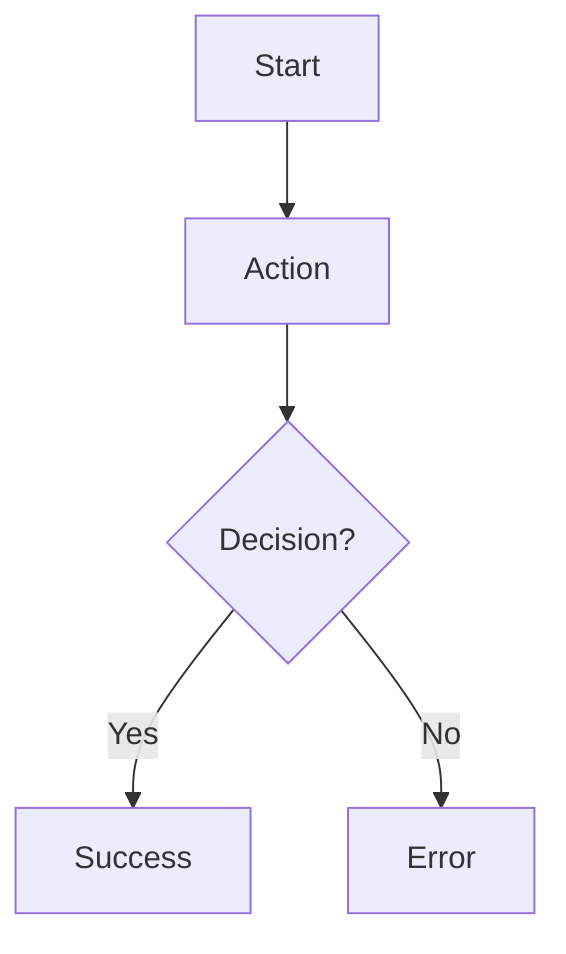
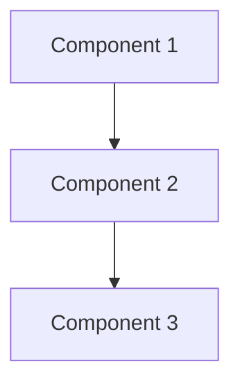

# [Project Name]

[Brief project description - what problem does this solve?]

---

## Table of Contents

- [Use Cases](#use-cases)
- [Flowchart](#flowchart)
- [Architecture](#architecture)
- [BDD Specs](#bdd-specs)

---

## Use Cases

### [Use Case Name 1]

#### Data:

- [Input 1]
- [Input 2]

#### Primary course (happy path):

1. [Step 1]
2. [Step 2]
3. [Step 3]
4. System delivers [output]

#### [Error Name] – error course (sad path):

1. System delivers [error output]

---

### [Use Case Name 2]

[Repeat structure...]

---

## Flowchart

[Insert flowchart diagram here - recommended: Mermaid, PlantUML, or image]

Example Mermaid syntax:



---

## Architecture

[Insert architecture diagram showing component relationships]

Example Mermaid syntax:



---

## BDD Specs

### Story: [Story Title]

#### Narrative #1

```gherkin
As a [type of user]
I want [feature/functionality]
So [benefit/value]
```

#### Scenarios (Acceptance criteria)

```gherkin
Given [precondition]
And [additional precondition]
When [action]
Then [expected outcome]
And [additional outcome]
```

#### Narrative #2

[Additional narratives for different user types or contexts]

---

## Notes

[Any additional context, assumptions, or decisions]
