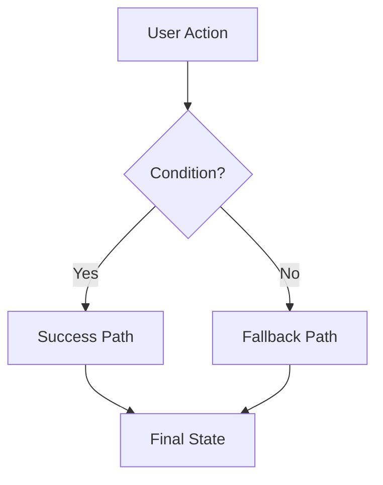
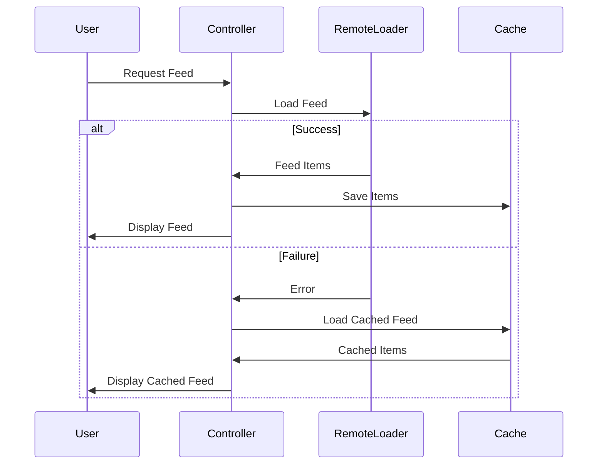
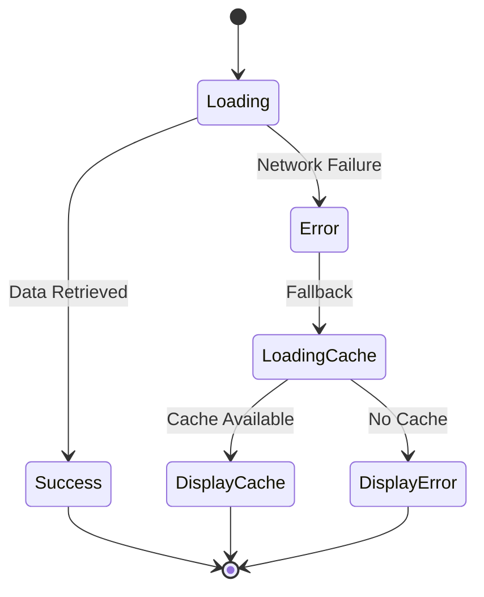
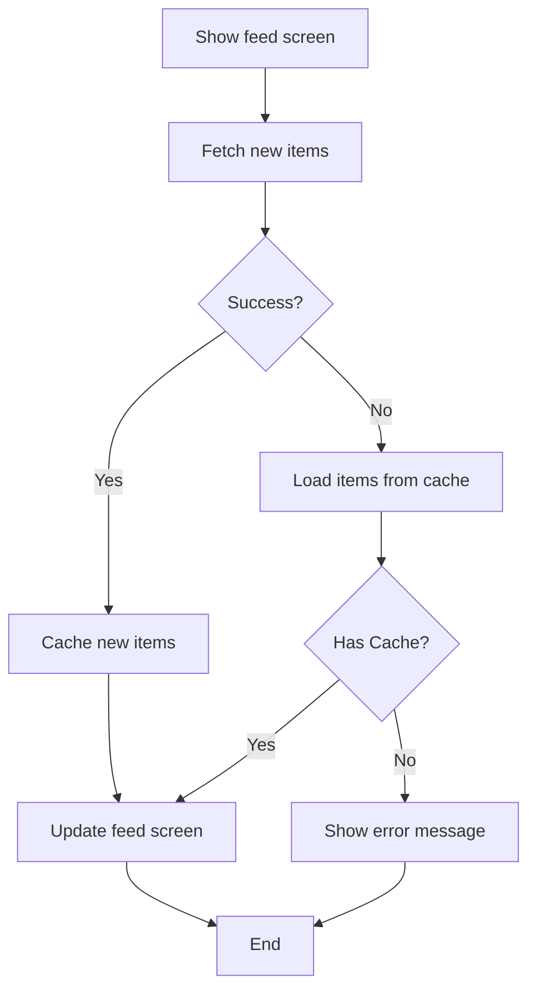
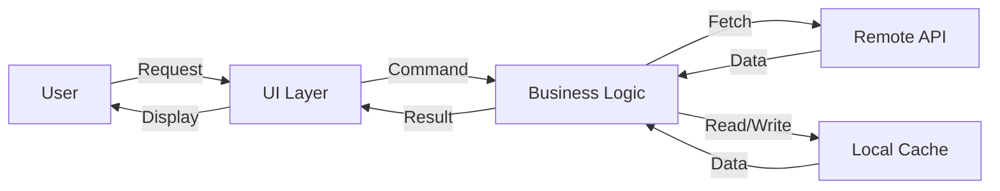

# Diagram Generation Guide

## Diagram Types for Requirements

### 1. Flowcharts (Behavioral Flow)
**When to use**: Show the sequence of decisions and actions in a feature workflow

**Tools**: Mermaid flowchart

**Example Pattern**:


### 2. Architecture Diagrams (Component Relationships)
**When to use**: Show the structure of modules and their dependencies

**Tools**: Mermaid flowchart or graph

**Example Pattern**:
```mermaid
graph TB
    subgraph "Composition Root"
        Factory[FeedLoaderFactory]
    end
    
    subgraph "Primary Strategies"
        Remote[RemoteFeedLoader]
        Local[LocalFeedLoader]
    end
    
    subgraph "Composite"
        Composite[RemoteWithLocalFallbackLoader]
    end
    
    Factory -.-> Composite
    Factory -.-> Remote
    Factory -.-> Local
    Composite --> Remote
    Composite --> Local
```

### 3. Sequence Diagrams (Interaction Flow)
**When to use**: Show the interaction between components over time

**Tools**: Mermaid sequence diagram

**Example Pattern**:


### 4. State Diagrams
**When to use**: Show the different states a feature can be in and transitions

**Tools**: Mermaid state diagram

**Example Pattern**:


## Mermaid Diagram Templates

### Feed Feature Flowchart Template


### Architecture Diagram Template
```mermaid
graph TB
    subgraph "Presentation Layer"
        UI[UIViewController]
        Controller[FeedViewController]
    end
    
    subgraph "Business Logic"
        Loader[FeedLoader Protocol]
        Remote[RemoteFeedLoader]
        Local[LocalFeedLoader]
        Composite[FallbackFeedLoader]
    end
    
    subgraph "Data Layer"
        API[HTTPClient]
        Store[FeedStore]
    end
    
    UI --> Controller
    Controller --> Loader
    Loader <|.. Remote
    Loader <|.. Local
    Loader <|.. Composite
    Composite --> Remote
    Composite --> Local
    Remote --> API
    Local --> Store
```

### Data Flow Diagram Template


## Drawing Tools and Conventions

### Color Coding
- **Green**: Happy path, success states, primary components
- **Red**: Error states, error handlers
- **Blue**: Data sources, external systems
- **Orange/Yellow**: Alternative paths, caching layers
- **Purple**: Controllers, coordinators

### Shape Conventions
- **Rectangles**: Components, modules, classes
- **Rounded rectangles**: Processes, actions
- **Diamonds**: Decision points, conditionals
- **Parallelograms**: Data, inputs/outputs
- **Circles**: Start/end states

### Arrow Styles
- **Solid arrows**: Direct dependencies, data flow
- **Dashed arrows**: Creation, composition
- **Dotted arrows**: Protocol conformance, interfaces

## Tips for Effective Diagrams

1. **Keep it simple**: Focus on the essential flow, avoid implementation details
2. **Use consistent naming**: Match names in diagrams to BDD stories and use cases
3. **Show both paths**: Include happy path AND error handling
4. **Layer appropriately**: High-level overview first, then detailed views
5. **Annotate decisions**: Label decision diamonds with clear conditions
6. **Group related components**: Use subgraphs or swimlanes
7. **Follow flow direction**: Top-to-bottom or left-to-right consistently
8. **Make it scannable**: Viewers should understand flow in 30 seconds

## Integration with Requirements

Diagrams should directly support the written requirements:

1. **From BDD to Flowchart**: Each scenario becomes a path through the flowchart
2. **From Use Cases to Sequence**: Each use case step becomes an interaction
3. **From Architecture to Components**: Each module becomes a component in diagrams
4. **From Narratives to Boundaries**: User types define system boundaries

## Example: Complete Feed Feature Diagrams

See the main SKILL.md for integrated examples showing how to generate:
- Feature workflow flowchart
- System architecture diagram
- Component interaction sequence
- Error handling flowchart
