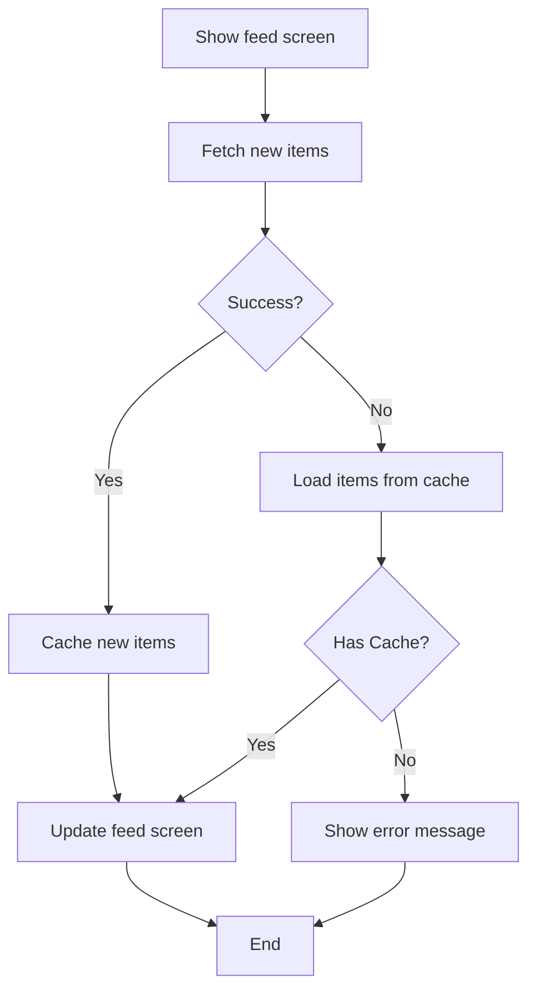
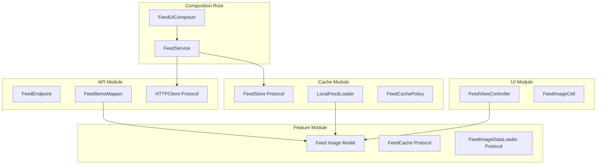
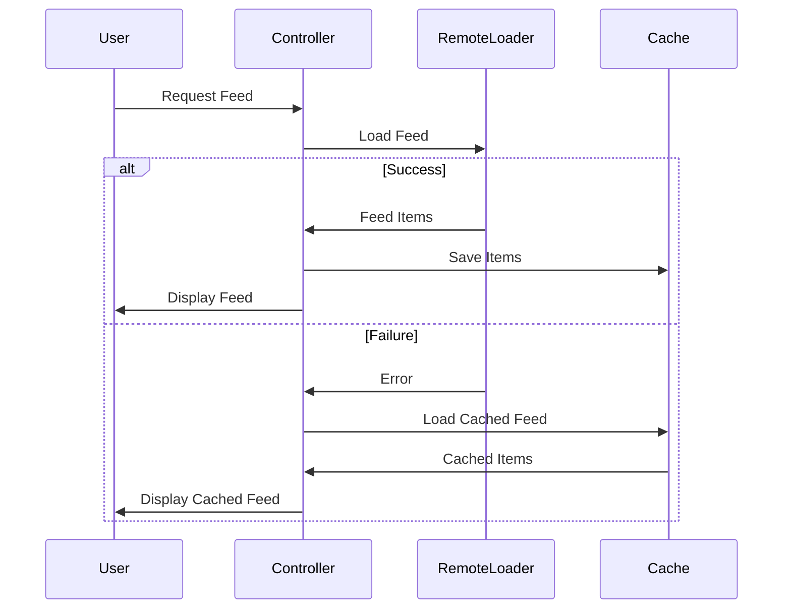
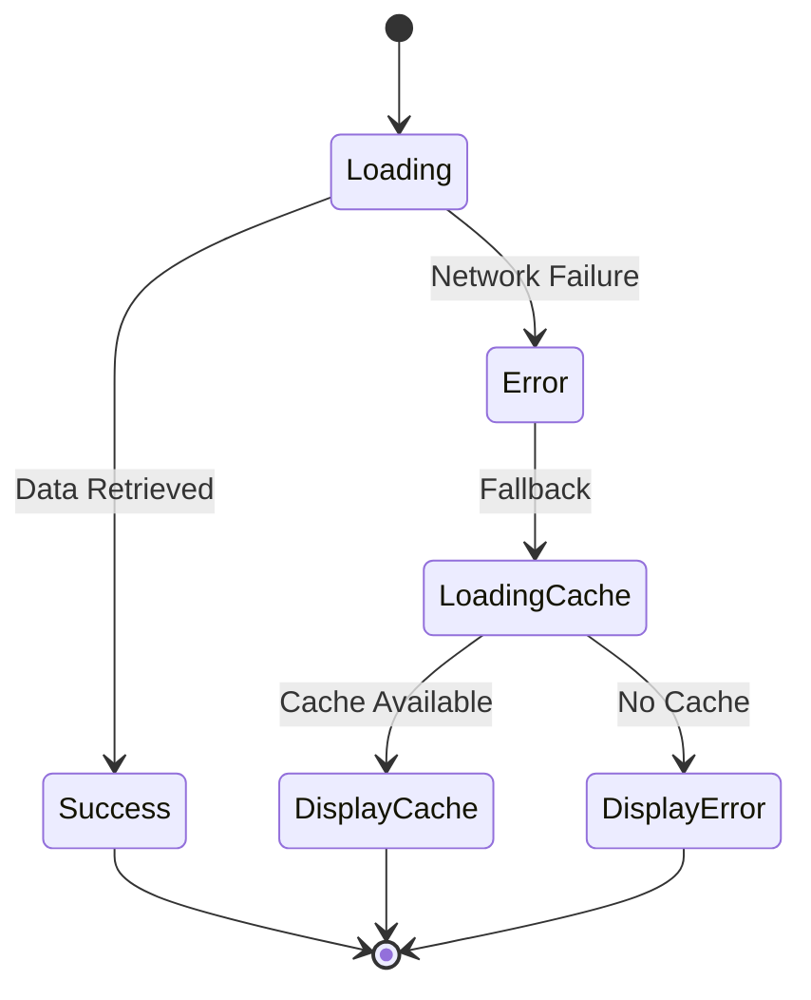

# Diagrams

Use this when:
- Creating flowcharts for feature workflows
- Drawing architecture or module dependency diagrams
- Generating sequence diagrams for component interactions
- Visualizing state machines

Skip this file if:
- You need BDD narratives. Use `bdd-narratives.md`.
- You need use case definitions. Use `use-cases.md`.

Jump to:
- [Diagram Selection](#diagram-selection)
- [Flowcharts](#1-flowcharts-behavioral-flow)
- [Architecture Diagrams](#2-architecture-diagrams-module-dependencies)
- [Sequence Diagrams](#3-sequence-diagrams-interaction-flow)
- [State Diagrams](#4-state-diagrams)
- [Dependency Diagram Notation](#dependency-diagram-notation)
- [Drawing Conventions](#drawing-conventions)
- [Integration with Requirements](#integration-with-requirements)

---

## Diagram Selection

| Need | Diagram type | When to use |
|---|---|---|
| Show decisions and actions in sequence | Flowchart | Feature workflow with branching logic |
| Show module structure and dependencies | Architecture diagram | System overview, dependency graph |
| Show component interactions over time | Sequence diagram | Request/response flows between components |
| Show states and transitions | State diagram | Feature lifecycle, UI state machine |

---

## 1. Flowcharts (Behavioral Flow)

Show the sequence of decisions and actions in a feature workflow. **Must include error/fallback branches** — not just the happy path.



**Rules**:
- Every decision diamond must have at least two branches (success/failure)
- Error paths must terminate in a user-visible outcome (error message, fallback display)
- Each BDD scenario maps to a path through the flowchart

---

## 2. Architecture Diagrams (Module Dependencies)

Show the **actual module structure and dependency graph** — not generic boxes.

### Module Dependency Diagram



**Rules**:
- Group components into modules using subgraphs
- Show actual protocol/class names, not generic labels
- Dependencies flow inward: UI -> Feature, Cache -> Feature, API -> Feature
- Composition Root imports everything, Feature module depends on nothing

### Component Relationships (simpler overview)

```mermaid
graph TB
    subgraph "Presentation Layer"
        UI[UIViewController]
        Controller[FeedViewController]
    end

    subgraph "Business Logic"
        Loader[FeedLoader Protocol]
        Remote[RemoteFeedLoader]
        Local[LocalFeedLoader]
    end

    subgraph "Data Layer"
        API[HTTPClient]
        Store[FeedStore]
    end

    UI --> Controller
    Controller --> Loader
    Loader <|.. Remote
    Loader <|.. Local
    Remote --> API
    Local --> Store
```

---

## 3. Sequence Diagrams (Interaction Flow)

Show the interaction between components over time. **Must include alt/else blocks** for error handling.



---

## 4. State Diagrams

Show the different states a feature can be in and transitions between them.



---

## Dependency Diagram Notation

This is the load-bearing notation of the methodology. A dependency arrow encodes **two** independent facts — the **line style** and the **arrowhead fill** — and each combination means something precise:

| Line | Head | Relationship | Meaning | Swift example |
|---|---|---|---|---|
| solid | open / empty (△) | **inherits from / is a** | one type is a subtype of another | `class MyViewController: UIViewController` |
| dashed | open / empty (△) | **conforms to / implements** | a type implements a protocol | `class URLSessionHTTPClient: HTTPClient` |
| solid | **filled (▶)** | **depends on / has a** (STRONG) | the type cannot exist without the other — a stored property | `let client: HTTPClient` held by `RemoteFeedLoader` |
| dashed | **filled (▶)** | **depends on / uses a** (WEAK) | the type uses the other but works without owning it — a method parameter | `func load(client: HTTPClient)` |

The two distinctions that carry the most meaning, and that generic "boxes and arrows" miss:

- **Head fill = inheritance/conformance vs. dependency.** Open head = "is a / conforms to". Filled head = "depends on".
- **Line style (on a filled head) = strong vs. weak dependency.** Solid = strong (a stored `let`, association/aggregation/composition — you cannot construct the type without it). Dashed = weak (a parameter — provided per call, the type is usable without it).

Direction matters: the arrow points **toward the thing depended upon**. Always include a small legend keying these four arrows, since the head fill is easy to miss at a glance.

> Mermaid can't render all four heads natively. When sketching in Mermaid, approximate (`-->` strong dependency, `-.->` weak dependency, `..|>` conformance, `--|>` inheritance) **and state the intended semantics in a legend** — the semantics above are what matter, not the exact glyph.

## Drawing Conventions

### Shape Conventions
- **Rectangles**: components / types. **Diamonds**: decision points. **Circles**: start/end. (Standard flowchart shapes — don't over-think them.)

---

## Integration with Requirements

Diagrams must directly support the written requirements:

| Requirement Artifact | Diagram Type | Mapping |
|---|---|---|
| BDD Scenarios | Flowchart | Each scenario = one path through the flowchart |
| Use Case steps | Sequence diagram | Each step = one interaction between participants |
| Architecture modules | Architecture diagram | Each module = one subgraph |
| User narratives | Sequence diagram | User types define the starting participants |
| Feature states | State diagram | Each UI/feature state = one node |

---

## Guardrails

- Do not create flowcharts with only the happy path — always include error/fallback branches
- Do not use generic labels ("Component A", "Module B") — use actual domain/class names
- Do not make diagrams that require explanation — they should be scannable in 30 seconds
- Do not mix flow directions within one diagram — choose top-to-bottom or left-to-right consistently
- Do not create diagrams that contradict the written requirements

## Verification

- [ ] Flowcharts include error/fallback branches for every decision
- [ ] Architecture diagrams use actual module/component names
- [ ] Sequence diagrams include alt/else blocks for error handling
- [ ] All diagram names match terms in BDD stories and use cases
- [ ] Dependencies flow in the correct direction (inward toward domain)
- [ ] Diagrams are scannable in 30 seconds
