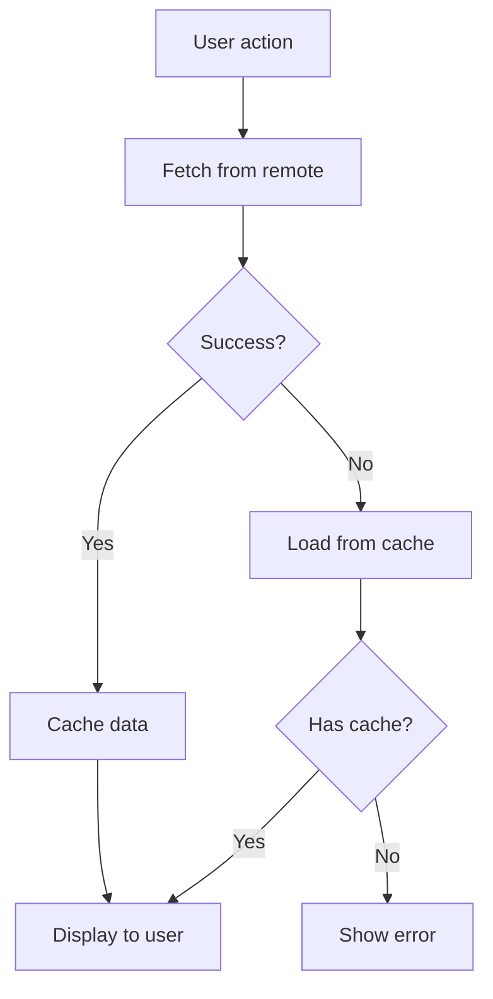
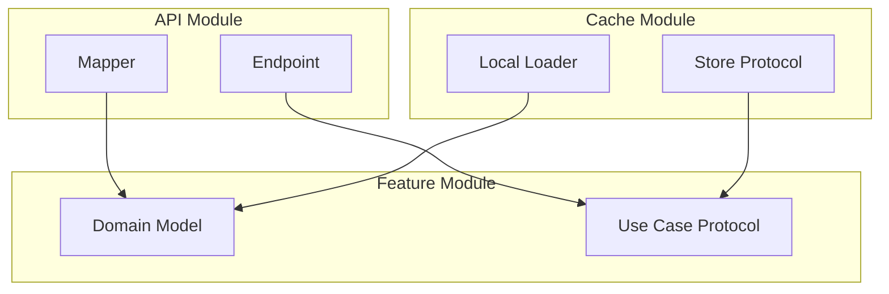

# Feature Specification Workflow

Use this when:
- Building a complete feature specification from scratch
- Adding a new feature to an existing specification
- Reviewing a specification for completeness
- Understanding how requirements map to architecture and tests

Skip this file if:
- You need a specific artifact template. Check the Reference Router in `SKILL.md` for the right file.

Jump to:
- [Feature Specification Block](#feature-specification-block)
- [Incremental Feature Development](#incremental-feature-development)
- [Requirements-to-Architecture Traceability](#requirements-to-architecture-traceability)
- [Living Specification](#living-specification)
- [Complete Feature Specification Template](#complete-feature-specification-template)

---

## Feature Specification Block

Each feature is a **self-contained block** with the artifacts it warrants. This block can be understood independently — a developer reading just the Feed feature spec has everything needed to implement it.

> **Include the artifacts the feature needs — not a mandatory seven.** Default to the full set for a non-trivial networked feature, but omit the ones that don't apply. The real Image Comments feature (Phase 4 below) is online-only, so it has **one** narrative, **one** use case, **no** cache/validate use cases, and **no** Cancel course — and that is correct. A feature reusing an existing model needs **no** new Model Spec. The architecture diagram is **app-level** and shared (see below), not one-per-feature.

**Structure of one feature block:**

```
## [Feature Name] Feature Specs

### Story: [Clear, user-focused title]

### Narrative #1
As a [user type]
I want [action]
So I can [value]

#### Scenarios (Acceptance criteria)
Given [precondition]
When [action]
Then [outcome]

## Use Cases

### [Use Case 1 Name]
#### Data:
- [inputs]
#### Primary course (happy path):
1. [steps]
#### [Error] -- error course (sad path):
1. [error handling]

### [Use Case 2 Name]
[...]

## Model Specs
### [Entity Name]
| Property | Type |
[...]

### Payload contract
[HTTP method + path + JSON]

## Flowchart
[Mermaid — per feature]

## Architecture
[App-level module dependency diagram — one shared graph, updated as modules are added]
```

> **Flowchart vs Architecture diagram.** The flowchart is **per feature** (one decision flow per feature). The architecture diagram is **app-level**: a single shared dependency graph for the whole system, updated each time a new module lands (the case study kept it as one exported image at the bottom of the README, not one-per-feature). When you "add Architecture to a feature block," you are really updating the shared app diagram to include that feature's module.

---

## Incremental Feature Development

Features are added as **independent blocks** without disrupting existing specifications.

### Example: image feed case study progression

**Phase 1 — Image Feed Feature:**
- BDD: 2 narratives (online customer, offline customer)
- Use Cases: Load Feed From Remote, Load Feed From Cache, Cache Feed
- Model: Feed Image (id, description, location, url)
- Payload: `GET /feed`

**Phase 2 — Feed Image Data (added later, no existing specs changed):**
- Use Cases: Load Feed Image Data From Remote, Load Feed Image Data From Cache, Cache Feed Image Data
- Added Cancel course: "System does not deliver image data nor error"
- No new model spec needed (uses binary `Data`)

**Phase 3 — Validate Cache (extracted from Load Feed From Cache):**
- Separated "Validate Feed Cache" as its own use case
- Original "Load Feed From Cache" kept its loading responsibility
- Demonstrates separation of concerns in requirements

**Phase 4 — Image Comments Feature (completely independent block):**
- BDD: 1 narrative (online customer only — no offline support needed)
- Use Cases: Load Image Comments From Remote
- Model: ImageComment (id, message, created_at, author), CommentAuthor (username)
- Payload: `GET /image/{image-id}/comments`
- Architecture diagram updated to show parallel Comments module

**Key pattern**: Each phase adds a self-contained block. Existing specifications are only modified when understanding of existing features changes (e.g., extracting Validate Cache). Note Phase 4 deliberately ships **fewer** artifacts than Phase 1 — online-only, so no offline narrative, no cache/validate use cases, no Cancel course. Artifact count follows the feature's behavior, not a fixed quota.

---

## Requirements-to-Architecture Traceability

Every requirement artifact maps to a concrete implementation artifact:

| Requirement Artifact | Maps to in Code | Example |
|---|---|---|
| BDD Acceptance Criteria | Acceptance tests | `FeedAcceptanceTests` |
| Use Case (name) | Use-case class or protocol | `LoadFeedFromRemoteUseCase` |
| Use Case Data section | Method parameters | `func load(url: URL)` |
| Use Case Primary course steps | Method implementation | Sequential operations |
| Use Case Error courses | Error types / throwing | `enum Error { case invalidData }` |
| Use Case Cancel course | Cancellation handling | `Task.isCancelled` checks |
| Model Spec | Domain model struct | `struct FeedImage: Hashable, Sendable` |
| Model Spec Property/Type | Stored properties | `let id: UUID` |
| Payload Contract | Decodable mapping struct | `private struct RemoteFeedItem: Decodable` |
| Payload Contract JSON keys | Coding keys | `"image"` -> `url` property |
| Flowchart | Test scenarios / control flow | Decision branches = test cases |
| Architecture Diagram | Module structure / SPM targets | `EssentialFeed`, `EssentialFeediOS` |

**Traceability principle**: If you can't point from a requirement artifact to code and back, something is missing.

> The "Maps to in Code" column is illustrative of the handoff target, not a prescription for *how* to implement. The implementation patterns (composition root, `Sendable`/`@MainActor`, SPM target layout, `Task.isCancelled`) belong to the **ios-architecture-expert** skill — this skill stops at the specification and hands off there.

---

## Living Specification

Requirements evolve with code. The specification is never "done" — it is a living document.

### When to update specifications

| Event | What to update |
|---|---|
| New feature added | Add complete feature block |
| Domain term renamed | Update ALL artifacts (see `domain-language.md`) |
| Use case responsibility split | Extract new use case, update existing |
| New error case discovered | Add error course to use case + BDD scenario |
| API contract changed | Update payload contract + model spec if needed |
| Architecture changed | Update architecture diagram |

### Commit discipline

When updating requirements, commit the specification change alongside the code change. This keeps the specification in sync with the code and makes the git history tell the story of how understanding evolved.

---

## Complete Feature Specification Template

Use this template for each new feature:

```markdown
## [Feature Name] Feature Specs

### Story: [Story title — clear, user-focused]

### Narrative #1

```
As a [specific user type]
I want [specific action/feature]
So I can [specific business value]
```

#### Scenarios (Acceptance criteria)

```
Given [specific precondition]
 When [specific user action]
 Then [specific expected outcome]
  And [additional outcomes if applicable]
```

[Add Narrative #2, #3 as needed for different user types or contexts]

---

## Use Cases

### [Use Case Name]

#### Data:
- [Input 1]
- [Input 2]

#### Primary course (happy path):
1. Execute "[Command Name]" command with above data.
2. System [validates/downloads/fetches] [data].
3. System [creates/transforms] [domain objects] from valid data.
4. System delivers [domain objects].

#### Cancel course:
1. System does not deliver [domain objects] nor error.

#### [Error Type] -- error course (sad path):
1. System delivers [specific error].

#### [Another Error Type] -- error course (sad path):
1. System delivers [specific error].

---

## Model Specs

### [Entity Name]

| Property      | Type                |
|---------------|---------------------|
| `[property]`  | `[Type]`            |
| `[property]`  | `[Type]` (optional) |

### Payload contract

```
[HTTP METHOD] /[path]

[status code] RESPONSE

{
    "[key]": [
        {
            "[property]": "[example value]",
            "[optional_property]": "[example value]"
        },
        {
            "[property]": "[example value]"
        }
    ]
}
```

---

## Flowchart



## Architecture (app-level — update the shared diagram, don't make a new one per feature)


```

---

## Guardrails

- Do not pad a feature with artifacts it doesn't need — include the ones its behavior warrants (an online-only feature needs no offline narrative, cache use case, or Cancel course; a feature reusing a model needs no new Model Spec)
- Do not draw a separate architecture diagram per feature — there is ONE shared app-level dependency graph; update it as modules are added
- Do not modify existing feature specs unless the understanding of that feature has changed
- Do not break traceability — every requirement must map to testable code
- Do not write specifications that can only be understood with additional context — each feature block must be self-contained

## Verification

- [ ] Feature specification includes the artifacts the feature warrants (full set for a non-trivial networked feature; fewer for online-only / model-reusing features)
- [ ] Feature block is self-contained (can be understood independently)
- [ ] Architecture diagram is the shared app-level graph (not a per-feature one)
- [ ] Each use case has Data, Primary, Error, and Cancel courses where applicable
- [ ] Model Specs use Property/Type tables
- [ ] Payload Contract shows HTTP method, path, status code, and JSON
- [ ] Flowchart includes error branches
- [ ] Architecture diagram shows module dependencies
- [ ] Domain terminology is consistent across all artifacts
- [ ] Traceability: every artifact maps to implementation
